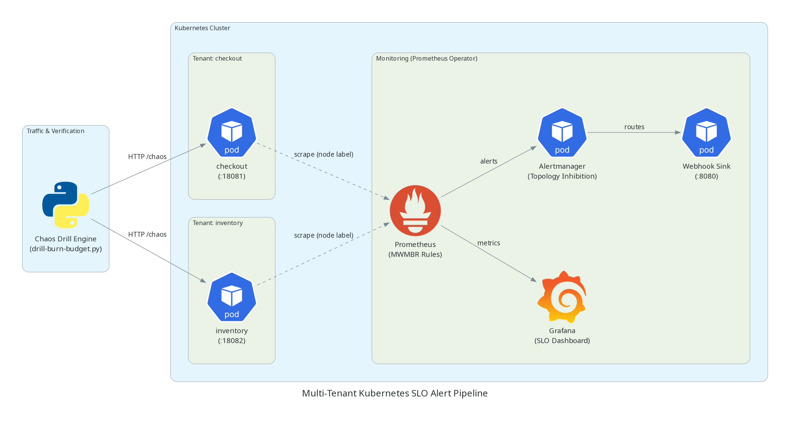
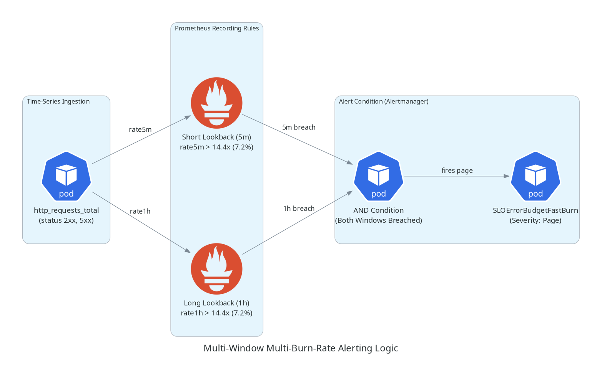
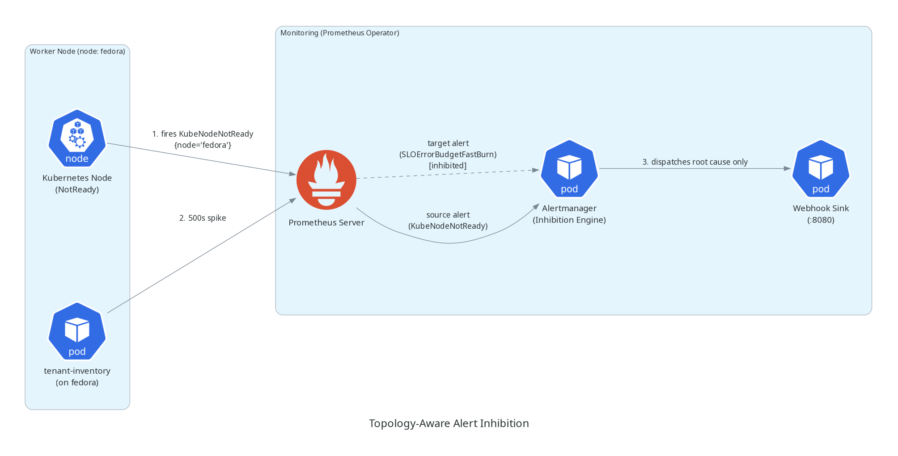

# System Architecture

This document describes the end-to-end architecture, tenant boundaries, data flows, and alert inhibition mechanics of the multi-tenant SLO alert pipeline.

---

## Architectural Overview

The pipeline implements multi-window multi-burn-rate (MWMBR) alerting on Kubernetes. Workloads run in dedicated tenant namespaces, while the Prometheus Operator stack runs in `monitoring`. Alerts route through Alertmanager, which enforces topology-aware inhibition to eliminate cascade noise during infrastructure failures.

---

## Core Capabilities

### Multi-Window Multi-Burn-Rate (MWMBR) Alerting

Single-window alerts suffer from false alarms on transient spikes or unacceptable delays during catastrophic outages. This pipeline enforces dual lookback windows that must be breached simultaneously:

| Alert Tier | Lookback Windows | Burn Multiplier | Budget Consumed | Error Rate (99.5% SLO) | Severity | Action |
| :--- | :--- | :--- | :--- | :--- | :--- | :--- |
| **Fast Burn** | 5m & 1h | 14.4x | 2% in 1 hour | > 7.2% | Critical (Page) | Urgent triage (rapid budget loss) |
| **Slow Burn** | 30m & 6h | 6.0x | 5% in 6 hours | > 3.0% | Warning (Ticket) | Triage gradual degradation |
| **Local Drill** | 2m & 15m | 14.4x | Fast test cycle | > 7.2% | Critical (Local) | Accelerated drill testing |

Detailed architectural rationale and PromQL math are documented in [ADR 001](adr/001-multi-window-burn-rate-strategy.md).

### Topology-Aware Alert Inhibition

When an underlying Kubernetes node crashes (`KubeNodeNotReady`), standard monitoring generates cascading alerts across every tenant workload on that node.

This pipeline uses Downward API relabeling (`__meta_kubernetes_pod_node_name` -> `node`) in tenant `ServiceMonitor` resources and root Alertmanager `inhibit_rules` to automatically suppress application-tier alerts when their host node is down:

Detailed relabeling configs and matcher strategies are documented in [ADR 002](adr/002-topology-aware-inhibition-relabeling.md).
